# Covid-19 Vaccine Hesistancy Analysis with Linear Regression 

## Part 0: Imports
###### I use several python libraries both to manipulate and graph the data. Mainly Pandas, Numpy, Matplotlib, and SKLearn.
```python
import pandas as pd
import numpy as np
import matplotlib.pyplot as plt
from sklearn.tree import DecisionTreeRegressor
import seaborn as sns
from sklearn.linear_model import LinearRegression
```

## Part 1: Data Collection

###### The dataset used in this project was information about vaccine hesitancy combined with various pieces of demographic and geographic information. The dataset was last updated on May 15th, 2021 and comes directly from [data.gov](https://catalog.data.gov/dataset/vaccine-hesitancy-for-covid-19-county-and-local-estimates-ed70f).

```python
# Import the csv using pandas and then use head to display the beginning of the dataset. 
data = pd.read_csv('vaccine_hesitancy_new.csv')
data.head()
```

<div>
<style scoped>
    .dataframe tbody tr th:only-of-type {
        vertical-align: middle;
    }

    .dataframe tbody tr th {
        vertical-align: top;
    }

    .dataframe thead th {
        text-align: right;
    }
</style>
<table border="1" class="dataframe">
  <thead>
    <tr style="text-align: right;">
      <th></th>
      <th>FIPS Code</th>
      <th>County Name</th>
      <th>State</th>
      <th>Estimated hesitant</th>
      <th>Estimated strongly hesitant</th>
      <th>Social Vulnerability Index (SVI)</th>
      <th>SVI Category</th>
      <th>CVAC level of concern for vaccination rollout</th>
      <th>CVAC Level Of Concern</th>
      <th>Percent adults fully vaccinated against COVID-19</th>
      <th>Percent Hispanic</th>
      <th>Percent non-Hispanic American Indian/Alaska Native</th>
      <th>Percent non-Hispanic Asian</th>
      <th>Percent non-Hispanic Black</th>
      <th>Percent non-Hispanic Native Hawaiian/Pacific Islander</th>
      <th>Percent non-Hispanic White</th>
      <th>Geographical Point</th>
      <th>State Code</th>
      <th>County Boundary</th>
      <th>State Boundary</th>
    </tr>
  </thead>
  <tbody>
    <tr>
      <th>0</th>
      <td>1131</td>
      <td>Wilcox County, Alabama</td>
      <td>ALABAMA</td>
      <td>0.23</td>
      <td>0.11</td>
      <td>0.93</td>
      <td>Very High Concern</td>
      <td>0.94</td>
      <td>Very High Concern</td>
      <td>0.228</td>
      <td>0.0053</td>
      <td>0.0009</td>
      <td>0.0003</td>
      <td>0.6938</td>
      <td>0.0000</td>
      <td>0.2684</td>
      <td>POINT (-86.844516 32.756889)</td>
      <td>AL</td>
      <td>MULTIPOLYGON (((-87.52534299999999 32.132773, ...</td>
      <td>MULTIPOLYGON (((-88.139988 34.581703, -88.1352...</td>
    </tr>
    <tr>
      <th>1</th>
      <td>1129</td>
      <td>Washington County, Alabama</td>
      <td>ALABAMA</td>
      <td>0.23</td>
      <td>0.11</td>
      <td>0.73</td>
      <td>High Concern</td>
      <td>0.82</td>
      <td>Very High Concern</td>
      <td>0.192</td>
      <td>0.0146</td>
      <td>0.0731</td>
      <td>0.0025</td>
      <td>0.2354</td>
      <td>0.0000</td>
      <td>0.6495</td>
      <td>POINT (-86.844516 32.756889)</td>
      <td>AL</td>
      <td>MULTIPOLYGON (((-88.45317899999999 31.505388, ...</td>
      <td>MULTIPOLYGON (((-88.139988 34.581703, -88.1352...</td>
    </tr>
    <tr>
      <th>2</th>
      <td>1133</td>
      <td>Winston County, Alabama</td>
      <td>ALABAMA</td>
      <td>0.22</td>
      <td>0.11</td>
      <td>0.70</td>
      <td>High Concern</td>
      <td>0.80</td>
      <td>High Concern</td>
      <td>0.085</td>
      <td>0.0315</td>
      <td>0.0034</td>
      <td>0.0016</td>
      <td>0.0073</td>
      <td>0.0005</td>
      <td>0.9370</td>
      <td>POINT (-86.844516 32.756889)</td>
      <td>AL</td>
      <td>MULTIPOLYGON (((-87.63656399999999 34.120908, ...</td>
      <td>MULTIPOLYGON (((-88.139988 34.581703, -88.1352...</td>
    </tr>
    <tr>
      <th>3</th>
      <td>1127</td>
      <td>Walker County, Alabama</td>
      <td>ALABAMA</td>
      <td>0.23</td>
      <td>0.11</td>
      <td>0.75</td>
      <td>High Concern</td>
      <td>0.68</td>
      <td>High Concern</td>
      <td>0.158</td>
      <td>0.0249</td>
      <td>0.0015</td>
      <td>0.0049</td>
      <td>0.0617</td>
      <td>0.0000</td>
      <td>0.8895</td>
      <td>POINT (-86.844516 32.756889)</td>
      <td>AL</td>
      <td>MULTIPOLYGON (((-87.56108499999999 33.868713, ...</td>
      <td>MULTIPOLYGON (((-88.139988 34.581703, -88.1352...</td>
    </tr>
    <tr>
      <th>4</th>
      <td>2013</td>
      <td>Aleutians East Borough, Alaska</td>
      <td>ALASKA</td>
      <td>0.26</td>
      <td>0.12</td>
      <td>0.58</td>
      <td>Moderate Concern</td>
      <td>0.87</td>
      <td>Very High Concern</td>
      <td>0.195</td>
      <td>0.0901</td>
      <td>0.4588</td>
      <td>0.1968</td>
      <td>0.0322</td>
      <td>0.0100</td>
      <td>0.1321</td>
      <td>POINT (-151.631889 63.631126)</td>
      <td>AK</td>
      <td>MULTIPOLYGON (((-165.036163 54.576598, -165.01...</td>
      <td>MULTIPOLYGON (((-165.254162 60.917108, -165.30...</td>
    </tr>
  </tbody>
</table>
</div>

## Part 2: Data Management
###### I decided to focus more on the demographic side for this project as it would be easier to perform a mathematical analysis on so I decdied to remove the unnecessary columns from the dataset. I also got rid of the FIPS code and State Code as they are not needed.   

```python
# Cleaning up the data a little bit to hone in on demographic information
data.drop(columns=['FIPS Code', 'Geographical Point', 'State Code', 'County Boundary', 'State Boundary'], inplace=True)
```

###### Here I used the Pandas describe function to get a picture of what each of the features in the dataset looks like.
```python
data.describe(include='all')
```

<div>
<style scoped>
    .dataframe tbody tr th:only-of-type {
        vertical-align: middle;
    }

    .dataframe tbody tr th {
        vertical-align: top;
    }

    .dataframe thead th {
        text-align: right;
    }
</style>
<table border="1" class="dataframe">
  <thead>
    <tr style="text-align: right;">
      <th></th>
      <th>County Name</th>
      <th>State</th>
      <th>Estimated hesitant</th>
      <th>Estimated strongly hesitant</th>
      <th>Social Vulnerability Index (SVI)</th>
      <th>SVI Category</th>
      <th>CVAC level of concern for vaccination rollout</th>
      <th>CVAC Level Of Concern</th>
      <th>Percent adults fully vaccinated against COVID-19</th>
      <th>Percent Hispanic</th>
      <th>Percent non-Hispanic American Indian/Alaska Native</th>
      <th>Percent non-Hispanic Asian</th>
      <th>Percent non-Hispanic Black</th>
      <th>Percent non-Hispanic Native Hawaiian/Pacific Islander</th>
      <th>Percent non-Hispanic White</th>
    </tr>
  </thead>
  <tbody>
    <tr>
      <th>count</th>
      <td>3142</td>
      <td>3142</td>
      <td>3142.000000</td>
      <td>3142.000000</td>
      <td>3141.000000</td>
      <td>3142</td>
      <td>3142.000000</td>
      <td>3142</td>
      <td>2826.000000</td>
      <td>3142.000000</td>
      <td>3142.000000</td>
      <td>3142.000000</td>
      <td>3142.000000</td>
      <td>3142.000000</td>
      <td>3142.000000</td>
    </tr>
    <tr>
      <th>unique</th>
      <td>3142</td>
      <td>51</td>
      <td>NaN</td>
      <td>NaN</td>
      <td>NaN</td>
      <td>5</td>
      <td>NaN</td>
      <td>5</td>
      <td>NaN</td>
      <td>NaN</td>
      <td>NaN</td>
      <td>NaN</td>
      <td>NaN</td>
      <td>NaN</td>
      <td>NaN</td>
    </tr>
    <tr>
      <th>top</th>
      <td>Baxter County, Arkansas</td>
      <td>TEXAS</td>
      <td>NaN</td>
      <td>NaN</td>
      <td>NaN</td>
      <td>Very High Concern</td>
      <td>NaN</td>
      <td>Very High Concern</td>
      <td>NaN</td>
      <td>NaN</td>
      <td>NaN</td>
      <td>NaN</td>
      <td>NaN</td>
      <td>NaN</td>
      <td>NaN</td>
    </tr>
    <tr>
      <th>freq</th>
      <td>1</td>
      <td>254</td>
      <td>NaN</td>
      <td>NaN</td>
      <td>NaN</td>
      <td>629</td>
      <td>NaN</td>
      <td>629</td>
      <td>NaN</td>
      <td>NaN</td>
      <td>NaN</td>
      <td>NaN</td>
      <td>NaN</td>
      <td>NaN</td>
      <td>NaN</td>
    </tr>
    <tr>
      <th>mean</th>
      <td>NaN</td>
      <td>NaN</td>
      <td>0.195159</td>
      <td>0.092231</td>
      <td>0.500000</td>
      <td>NaN</td>
      <td>0.499965</td>
      <td>NaN</td>
      <td>0.188573</td>
      <td>0.094184</td>
      <td>0.018463</td>
      <td>0.013621</td>
      <td>0.089259</td>
      <td>0.000919</td>
      <td>0.762499</td>
    </tr>
    <tr>
      <th>std</th>
      <td>NaN</td>
      <td>NaN</td>
      <td>0.046295</td>
      <td>0.029343</td>
      <td>0.288842</td>
      <td>NaN</td>
      <td>0.288832</td>
      <td>NaN</td>
      <td>0.077621</td>
      <td>0.138647</td>
      <td>0.076340</td>
      <td>0.027665</td>
      <td>0.144283</td>
      <td>0.006240</td>
      <td>0.202157</td>
    </tr>
    <tr>
      <th>min</th>
      <td>NaN</td>
      <td>NaN</td>
      <td>0.060000</td>
      <td>0.020000</td>
      <td>0.000000</td>
      <td>NaN</td>
      <td>0.000000</td>
      <td>NaN</td>
      <td>0.002000</td>
      <td>0.000000</td>
      <td>0.000000</td>
      <td>0.000000</td>
      <td>0.000000</td>
      <td>0.000000</td>
      <td>0.006900</td>
    </tr>
    <tr>
      <th>25%</th>
      <td>NaN</td>
      <td>NaN</td>
      <td>0.170000</td>
      <td>0.070000</td>
      <td>0.250000</td>
      <td>NaN</td>
      <td>0.250000</td>
      <td>NaN</td>
      <td>0.148000</td>
      <td>0.022200</td>
      <td>0.001200</td>
      <td>0.002800</td>
      <td>0.006500</td>
      <td>0.000000</td>
      <td>0.644450</td>
    </tr>
    <tr>
      <th>50%</th>
      <td>NaN</td>
      <td>NaN</td>
      <td>0.190000</td>
      <td>0.090000</td>
      <td>0.500000</td>
      <td>NaN</td>
      <td>0.500000</td>
      <td>NaN</td>
      <td>0.188000</td>
      <td>0.042300</td>
      <td>0.002800</td>
      <td>0.006100</td>
      <td>0.021900</td>
      <td>0.000100</td>
      <td>0.837400</td>
    </tr>
    <tr>
      <th>75%</th>
      <td>NaN</td>
      <td>NaN</td>
      <td>0.220000</td>
      <td>0.110000</td>
      <td>0.750000</td>
      <td>NaN</td>
      <td>0.750000</td>
      <td>NaN</td>
      <td>0.229000</td>
      <td>0.096800</td>
      <td>0.006900</td>
      <td>0.012800</td>
      <td>0.098400</td>
      <td>0.000600</td>
      <td>0.924875</td>
    </tr>
    <tr>
      <th>max</th>
      <td>NaN</td>
      <td>NaN</td>
      <td>0.320000</td>
      <td>0.200000</td>
      <td>1.000000</td>
      <td>NaN</td>
      <td>1.000000</td>
      <td>NaN</td>
      <td>0.912000</td>
      <td>0.991700</td>
      <td>0.919000</td>
      <td>0.417300</td>
      <td>0.872300</td>
      <td>0.272700</td>
      <td>1.000000</td>
    </tr>
  </tbody>
</table>
</div>


## Part 3: Exploratory Data Analysis

###### Below is code to print out the violin plot for each feature so I could get a better look at the demographic infromation rather than just looking at the raw numbers from the describe function above. 

```python
fig, ax = plt.subplots(figsize=(5, 5))
ax.violinplot([data['Estimated hesitant'].dropna()], showmedians=True)
ax.set_xticks([0])

ax.set_title('Estimated Hesitancy by County')
plt.show()

fig, ax = plt.subplots(figsize=(5, 5))
ax.violinplot([data['Estimated strongly hesitant'].dropna()], showmedians=True)
ax.set_xticks([0])

ax.set_title('Estimated Strong Hesitancy by County')
plt.show()

fig, ax = plt.subplots(figsize=(5, 5))
ax.violinplot([data['Social Vulnerability Index (SVI)'].dropna()], showmedians=True)
ax.set_xticks([0])

ax.set_title('Social Vulnerability Index by County')
plt.show()

fig, ax = plt.subplots(figsize=(5, 5))
ax.violinplot([data['CVAC level of concern for vaccination rollout'].dropna()], showmedians=True)
ax.set_xticks([0])

ax.set_title('SCVAC Level of Concern for Vaccination Rollout by County')
plt.show()

fig, ax = plt.subplots(figsize=(5, 5))
ax.violinplot([data['Percent adults fully vaccinated against COVID-19'].dropna()], showmedians=True)
ax.set_xticks([0])

ax.set_title('Percent of Adults Fully Vaccinated Against COVID-19 by County')
plt.show()

fig, ax = plt.subplots(figsize=(5, 5))
ax.violinplot([data['Percent Hispanic'].dropna()], showmedians=True)
ax.set_xticks([0])

ax.set_title('Percent Hispanic by County')
plt.show()

fig, ax = plt.subplots(figsize=(5, 5))
ax.violinplot([data['Percent non-Hispanic American Indian/Alaska Native'].dropna()], showmedians=True)
ax.set_xticks([0])

ax.set_title('Percent non-Hispanic American Indian/Alaska Native by County')
plt.show()

fig, ax = plt.subplots(figsize=(5, 5))
ax.violinplot([data['Percent non-Hispanic Asian'].dropna()], showmedians=True)
ax.set_xticks([0])

ax.set_title('Percent non-Hispanic Asian by County')
plt.show()

fig, ax = plt.subplots(figsize=(5, 5))
ax.violinplot([data['Percent non-Hispanic Black'].dropna()], showmedians=True)
ax.set_xticks([0])

ax.set_title('Percent non-Hispanic Black by County')
plt.show()

fig, ax = plt.subplots(figsize=(5, 5))
ax.violinplot([data['Percent non-Hispanic Native Hawaiian/Pacific Islander'].dropna()], showmedians=True)
ax.set_xticks([0])

ax.set_title('Percent non-Hispanic Native Hawaiian/Pacific Islander by County')
plt.show()

fig, ax = plt.subplots(figsize=(5, 5))
ax.violinplot([data['Percent non-Hispanic White'].dropna()], showmedians=True)
ax.set_xticks([0])

ax.set_title('Percent non-Hispanic White by County')
plt.show()
```

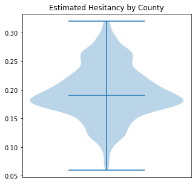
###### The estimated hesitancy is a fairly even distribution with a middle at around 20% of people and falling off at about the same rate on both sides. 

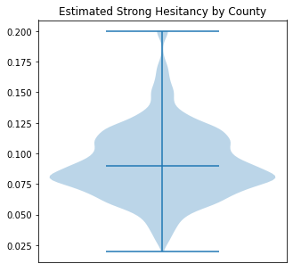
###### Strong hesitancy however is different, it is centered at around 8% of people with a tail going off at the top for counties with more strong hesitancy. 

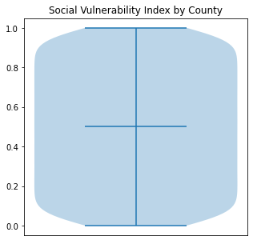
###### Since social vulnerability index is likely a percentile measurement it makes sense for it to be perfectly even throughout and taper off on the ends. 

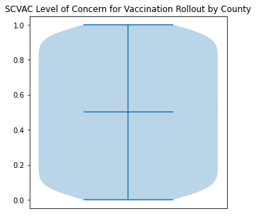
###### The same idea applies for SVAC Level of Concern for Vaccination Rollout.

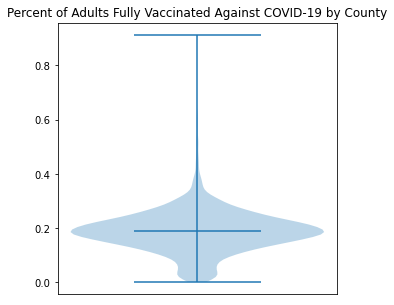
###### The level of vaccination per county is one of the best datapoints I have to work with. There is no estimation as it only gives us the facts of who has been vaccinated. Most counties seem to be clustered around 20% fully vaccinated but with a significant tail going off at the top of a small number of counties with way higher vaccination rates. However, there is a bulge at the bottom which indicates to me that most counties struggling with their vaccination rollout have vaccinated around the same amount of people and very few counties are located at the absolute bottom.  

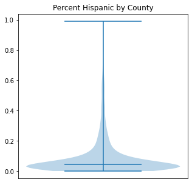
###### Percent Hispanic by County seems to be heavily clustered at around 10%, but with a massive tail of some counties with a significantly higher Hispanic population. 

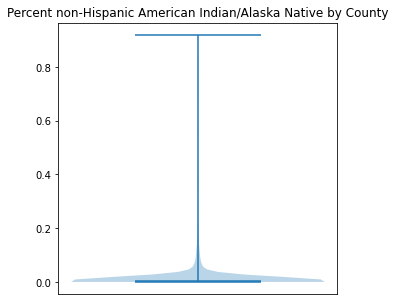
###### Percent non-Hispanic American Indians and Alaskan Natives are heavily clustered at around 2-3% of the population but with a tail that seems to go up to roughly 15%. 

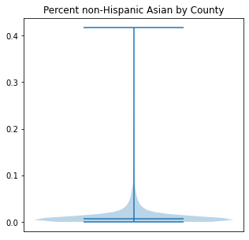
###### Percent non-Hispanic Asian by County are heavily clustered at around 2-3% of the population but with a tail that seems to go up to roughly 10%. An interesting thing to note here could be that American Indians and Alaskan Natives have similar numbers as Asian Americans despite having significantly lower population. Why? My hypothesis is that since the data is organized by County, Asian Americans are located in Heavily populated counties where the make up a similar portion as American Indians / Alaskan Natives but in places with significnatly lower population overall. American Indians could likely live in mostly small population areas. 

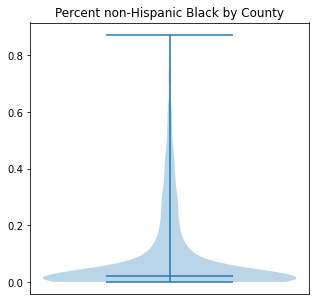
###### Percent non-Hispanic Black seems to be heavily clustered at around 5% but with an enormous tail that is very wide at certain parts that stretches to almost 80%. This indicates that some counties with non-Hispanic Blacks are almost entirely compromised of non-Hispanic Blacks. 

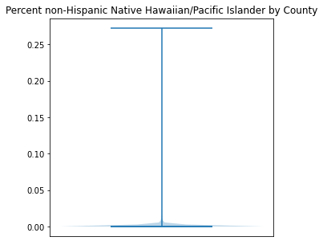
###### Percent non-Hispanic Native Hawaiian/Pacific Islander is very heavily clustered at or below 1%. There is a small tail that goes up to about 5%. 

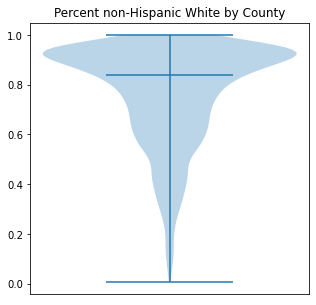
###### Percent of non-Hispanic Whites by county is most heavily clustered around 85-90% of the population but with a huge tail that goes all the way down to 0%. Many Whites seem to live in counties that are almost exclusively Whites but many also live in more Diverse areas. 

###### Next I use the correlation function that is provided by Pandas to find the correlation between the various features in the dataset. 

```python
plt.subplots(figsize = (10,10))

corr = data.corr()

# The Numpy triu function is used to make it so the matrix only shows one half of itself (the other side would simply be a duplicate)
matrix = np.triu(corr)

# Using the Seaborn heatmap with a red-blue color scheme to graph the data
heatmap = sns.heatmap(corr, cmap='RdBu', linewidths=1, mask=matrix)

# Set titles and labels
heatmap.set_title("Correlation Matrix between Features")
heatmap.set_xticklabels(heatmap.get_xticklabels(), rotation=45, horizontalalignment='right')
heatmap.set_yticklabels(heatmap.get_yticklabels(), rotation=45, horizontalalignment='right')
```

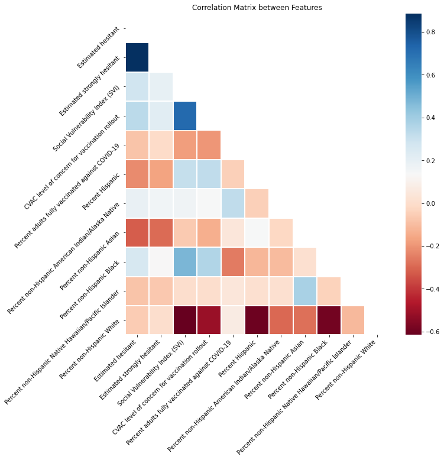

###### The correlation matrix allowed me to learn several interesting things about the data. First, there was the obvious obvious prediction that came true of Strong Vaccine Hesitancy being highly correlated with Vaccine Hesitancy overall. Additionally, the CVAC level of concern for the vaccine rollout was highly correlated with the Social Vulnerability Index. The Social Vulnerability index was also heavily correlated with the percent of a County that is Black of Hispanic. Unlike I expected (considering the recent news of White, Conservative Americans being the most hesitant) the Percentage of Whites was actually negatively correlated with Vaccine hesitancy. However, vaccine hesitancy was still correlated with the percentage of a County that was non-Hispanic Black. 

###### Next, I wanted to find the importance of various features in the dataset using a DecisionTreeRegressor when looking at their impact on vaccine hesitancy. 
```python
model = DecisionTreeRegressor()

# Get rid of any nans within the data
X = data.dropna()

# Grab the estimated hesitant column as y
y = X['Estimated hesitant']

# Drop the columns that won't be needed. I decided to get rid of the remaining geographical data as I thought it wasn't crucial for me and the estimated strongly hesitant 
# out of fear it would dominate the other ones considering how much it was correlated with normal hesitancy. I also got rid of the categories considering they basically
# just put names on continuous data we already have so there was no need to transform it. 
X = X.drop(columns=['State', 'County Name', 'Estimated hesitant', 'SVI Category', 'CVAC Level Of Concern', 'Estimated strongly hesitant'])

# Fit the model
model.fit(X, y)

# Grab the importances of each feature
importance = model.feature_importances_

# Labels for graphing
labels = ['Social Vulnerability Index (SVI)', 'CVAC level of concern for vaccination rollout', 'Percent adults fully vaccinated against COVID-19', 'Percent Hispanic', 'Percent non-Hispanic American Indian/Alaska Native', 'Percent non-Hispanic Asian', 'Percent non-Hispanic Black', 'Percent non-Hispanic Native Hawaiian/Pacific Islander', 'Percent non-Hispanic White']

# Graph the feature importance in a bar plot
fig, ax = plt.subplots(figsize=(10, 5))
ax.set_xticklabels(labels, rotation=45, horizontalalignment='right')
ax.bar(labels, importance)

ax.set_title('Feature Importance')
plt.show()
```
    
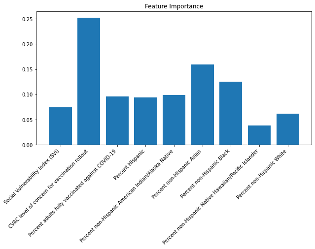

###### This yielded very interesting results. As expected, the CVAC Level of Concern showed up as clearly the most important feature for determining vaccine hesitancy, indicating to me that it is a reliable metric. Additionally, the percent of non-Hispanic Asians and the Percent of non-Hispanic blacks also stood out as important features in determining vaccine hesitancy.

## Part 4: Hypothesis Testing and Machine Learning

```python
cleandata = data.dropna()
```


```python
X = np.array(cleandata['CVAC level of concern for vaccination rollout']).reshape((-1, 1))
y = np.array(cleandata['Estimated hesitant'])

model = LinearRegression().fit(X, y)

b = model.intercept_
m = model.coef_

ig, ax = plt.subplots(figsize=(10, 10))
ax.plot(X, y, 'o')
ax.plot(X, m*X + b)
ax.set_title('Hesistancy by CVAC Level of Concern')
ax.set_xlabel('CVAC Level of Concern')
ax.set_ylabel('Hesitancy')

plt.show()
print("Slope:", m[0])
```


    
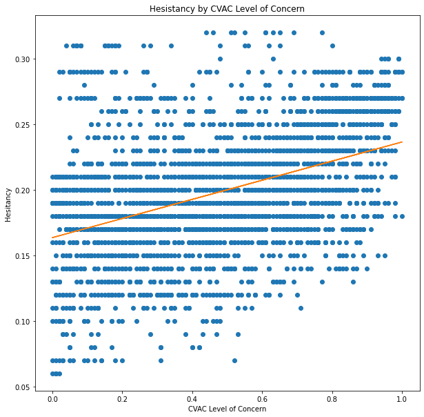
    


    Slope: 0.07290005882032274


```python
X = np.array(cleandata['Social Vulnerability Index (SVI)']).reshape((-1, 1))
y = np.array(cleandata['Estimated hesitant'])

model = LinearRegression().fit(X, y)

b = model.intercept_
m = model.coef_

ig, ax = plt.subplots(figsize=(10, 10))
ax.plot(X, y, 'o')
ax.plot(X, m*X + b)
ax.set_title('Hesistancy by Social Vulnerability Index')
ax.set_xlabel('Social Vulnerability Index')
ax.set_ylabel('Hesitancy')

plt.show()
print("Slope:", m[0])
```


    
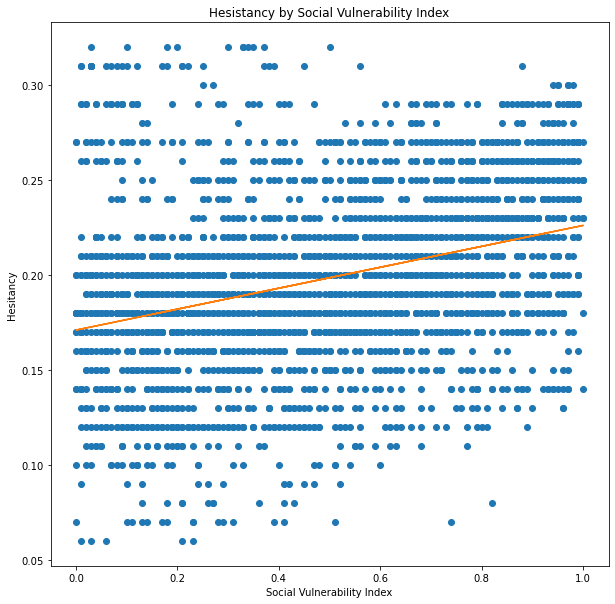
    


    Slope: 0.05506167108287122


```python
X = np.array(cleandata['Percent non-Hispanic White']).reshape((-1, 1))
y = np.array(cleandata['Estimated hesitant'])

model = LinearRegression().fit(X, y)

b = model.intercept_
m = model.coef_

ig, ax = plt.subplots(figsize=(10, 10))
ax.plot(X, y, 'o')
ax.plot(X, m*X + b)
ax.set_title('Hesistancy by Percent non-Hispanic White')
ax.set_xlabel('Percent in County of non-Hispanic Whites')
ax.set_ylabel('Hesitancy')

plt.show()
print("Slope:", m[0])
```


    
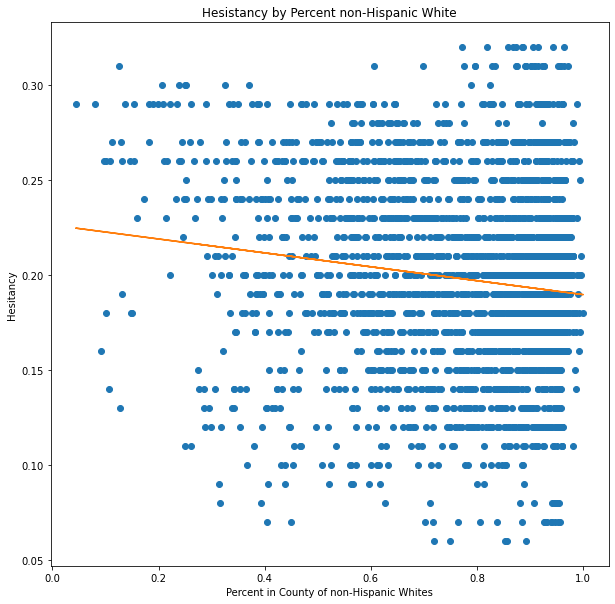
    


    Slope: -0.036596510203248354


```python
X = np.array(cleandata['Percent non-Hispanic Black']).reshape((-1, 1))
y = np.array(cleandata['Estimated hesitant'])

model = LinearRegression().fit(X, y)

b = model.intercept_
m = model.coef_

ig, ax = plt.subplots(figsize=(10, 10))
ax.plot(X, y, 'o')
ax.plot(X, m*X + b)
ax.set_title('Hesistancy by Percent non-Hispanic Blacks')
ax.set_xlabel('Percent in County of non-Hispanic Blacks')
ax.set_ylabel('Hesitancy')

plt.show()
print("Slope:", m[0])
```


    
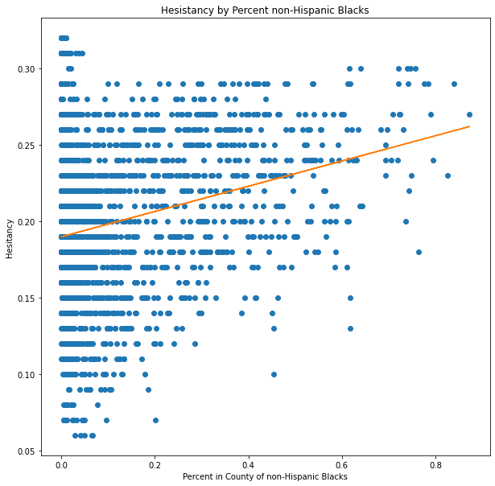
    


    Slope: 0.08265342968688802


```python
X = np.array(cleandata['Percent Hispanic']).reshape((-1, 1))
y = np.array(cleandata['Estimated hesitant'])

model = LinearRegression().fit(X, y)

b = model.intercept_
m = model.coef_

ig, ax = plt.subplots(figsize=(10, 10))
ax.plot(X, y, 'o')
ax.plot(X, m*X + b)
ax.set_title('Hesistancy by Percent of Hispanics')
ax.set_xlabel('Percent in County of Hispanics')
ax.set_ylabel('Hesitancy')

plt.show()
print("Slope:", m[0])
```


    

    


    Slope: -0.10682711674765767

## Part 5: Conclusion
