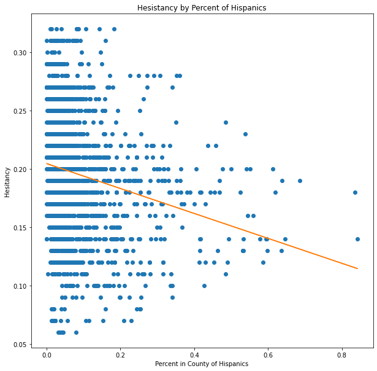

## Covid-19 Vaccine Hesitancy Analysis with Linear Regression

```python
import pandas as pd
import numpy as np
import matplotlib.pyplot as plt
from sklearn.tree import DecisionTreeRegressor
import seaborn as sns
from sklearn.linear_model import LinearRegression
```


```python
# The dataset used in this project came from the website Kaggle, a popular site for downloading open source datasets. 
# The data itself was collected from data.gov
# This is a dataset that countains demographic data regarding the vaccine hesitancy and vaccination levels of every county in
# in the US combined with various metrics about social vulnerability. 
# https://www.kaggle.com/deepshah16/vaccine-hesitancy-for-covid19

data = pd.read_csv('vaccine_hesitancy_new.csv')
data.head()
```


<div>
<style scoped>
    .dataframe tbody tr th:only-of-type {
        vertical-align: middle;
    }

    .dataframe tbody tr th {
        vertical-align: top;
    }

    .dataframe thead th {
        text-align: right;
    }
</style>
<table border="1" class="dataframe">
  <thead>
    <tr style="text-align: right;">
      <th></th>
      <th>FIPS Code</th>
      <th>County Name</th>
      <th>State</th>
      <th>Estimated hesitant</th>
      <th>Estimated strongly hesitant</th>
      <th>Social Vulnerability Index (SVI)</th>
      <th>SVI Category</th>
      <th>CVAC level of concern for vaccination rollout</th>
      <th>CVAC Level Of Concern</th>
      <th>Percent adults fully vaccinated against COVID-19</th>
      <th>Percent Hispanic</th>
      <th>Percent non-Hispanic American Indian/Alaska Native</th>
      <th>Percent non-Hispanic Asian</th>
      <th>Percent non-Hispanic Black</th>
      <th>Percent non-Hispanic Native Hawaiian/Pacific Islander</th>
      <th>Percent non-Hispanic White</th>
      <th>Geographical Point</th>
      <th>State Code</th>
      <th>County Boundary</th>
      <th>State Boundary</th>
    </tr>
  </thead>
  <tbody>
    <tr>
      <th>0</th>
      <td>1131</td>
      <td>Wilcox County, Alabama</td>
      <td>ALABAMA</td>
      <td>0.23</td>
      <td>0.11</td>
      <td>0.93</td>
      <td>Very High Concern</td>
      <td>0.94</td>
      <td>Very High Concern</td>
      <td>0.228</td>
      <td>0.0053</td>
      <td>0.0009</td>
      <td>0.0003</td>
      <td>0.6938</td>
      <td>0.0000</td>
      <td>0.2684</td>
      <td>POINT (-86.844516 32.756889)</td>
      <td>AL</td>
      <td>MULTIPOLYGON (((-87.52534299999999 32.132773, ...</td>
      <td>MULTIPOLYGON (((-88.139988 34.581703, -88.1352...</td>
    </tr>
    <tr>
      <th>1</th>
      <td>1129</td>
      <td>Washington County, Alabama</td>
      <td>ALABAMA</td>
      <td>0.23</td>
      <td>0.11</td>
      <td>0.73</td>
      <td>High Concern</td>
      <td>0.82</td>
      <td>Very High Concern</td>
      <td>0.192</td>
      <td>0.0146</td>
      <td>0.0731</td>
      <td>0.0025</td>
      <td>0.2354</td>
      <td>0.0000</td>
      <td>0.6495</td>
      <td>POINT (-86.844516 32.756889)</td>
      <td>AL</td>
      <td>MULTIPOLYGON (((-88.45317899999999 31.505388, ...</td>
      <td>MULTIPOLYGON (((-88.139988 34.581703, -88.1352...</td>
    </tr>
    <tr>
      <th>2</th>
      <td>1133</td>
      <td>Winston County, Alabama</td>
      <td>ALABAMA</td>
      <td>0.22</td>
      <td>0.11</td>
      <td>0.70</td>
      <td>High Concern</td>
      <td>0.80</td>
      <td>High Concern</td>
      <td>0.085</td>
      <td>0.0315</td>
      <td>0.0034</td>
      <td>0.0016</td>
      <td>0.0073</td>
      <td>0.0005</td>
      <td>0.9370</td>
      <td>POINT (-86.844516 32.756889)</td>
      <td>AL</td>
      <td>MULTIPOLYGON (((-87.63656399999999 34.120908, ...</td>
      <td>MULTIPOLYGON (((-88.139988 34.581703, -88.1352...</td>
    </tr>
    <tr>
      <th>3</th>
      <td>1127</td>
      <td>Walker County, Alabama</td>
      <td>ALABAMA</td>
      <td>0.23</td>
      <td>0.11</td>
      <td>0.75</td>
      <td>High Concern</td>
      <td>0.68</td>
      <td>High Concern</td>
      <td>0.158</td>
      <td>0.0249</td>
      <td>0.0015</td>
      <td>0.0049</td>
      <td>0.0617</td>
      <td>0.0000</td>
      <td>0.8895</td>
      <td>POINT (-86.844516 32.756889)</td>
      <td>AL</td>
      <td>MULTIPOLYGON (((-87.56108499999999 33.868713, ...</td>
      <td>MULTIPOLYGON (((-88.139988 34.581703, -88.1352...</td>
    </tr>
    <tr>
      <th>4</th>
      <td>2013</td>
      <td>Aleutians East Borough, Alaska</td>
      <td>ALASKA</td>
      <td>0.26</td>
      <td>0.12</td>
      <td>0.58</td>
      <td>Moderate Concern</td>
      <td>0.87</td>
      <td>Very High Concern</td>
      <td>0.195</td>
      <td>0.0901</td>
      <td>0.4588</td>
      <td>0.1968</td>
      <td>0.0322</td>
      <td>0.0100</td>
      <td>0.1321</td>
      <td>POINT (-151.631889 63.631126)</td>
      <td>AK</td>
      <td>MULTIPOLYGON (((-165.036163 54.576598, -165.01...</td>
      <td>MULTIPOLYGON (((-165.254162 60.917108, -165.30...</td>
    </tr>
  </tbody>
</table>
</div>


```python
# Cleaning up the data a little bit to hone in on demographic information
data.drop(columns=['FIPS Code', 'Geographical Point', 'State Code', 'County Boundary', 'State Boundary'], inplace=True)
```


```python
data.describe(include='all')
```


<div>
<style scoped>
    .dataframe tbody tr th:only-of-type {
        vertical-align: middle;
    }

    .dataframe tbody tr th {
        vertical-align: top;
    }

    .dataframe thead th {
        text-align: right;
    }
</style>
<table border="1" class="dataframe">
  <thead>
    <tr style="text-align: right;">
      <th></th>
      <th>County Name</th>
      <th>State</th>
      <th>Estimated hesitant</th>
      <th>Estimated strongly hesitant</th>
      <th>Social Vulnerability Index (SVI)</th>
      <th>SVI Category</th>
      <th>CVAC level of concern for vaccination rollout</th>
      <th>CVAC Level Of Concern</th>
      <th>Percent adults fully vaccinated against COVID-19</th>
      <th>Percent Hispanic</th>
      <th>Percent non-Hispanic American Indian/Alaska Native</th>
      <th>Percent non-Hispanic Asian</th>
      <th>Percent non-Hispanic Black</th>
      <th>Percent non-Hispanic Native Hawaiian/Pacific Islander</th>
      <th>Percent non-Hispanic White</th>
    </tr>
  </thead>
  <tbody>
    <tr>
      <th>count</th>
      <td>3142</td>
      <td>3142</td>
      <td>3142.000000</td>
      <td>3142.000000</td>
      <td>3141.000000</td>
      <td>3142</td>
      <td>3142.000000</td>
      <td>3142</td>
      <td>2826.000000</td>
      <td>3142.000000</td>
      <td>3142.000000</td>
      <td>3142.000000</td>
      <td>3142.000000</td>
      <td>3142.000000</td>
      <td>3142.000000</td>
    </tr>
    <tr>
      <th>unique</th>
      <td>3142</td>
      <td>51</td>
      <td>NaN</td>
      <td>NaN</td>
      <td>NaN</td>
      <td>5</td>
      <td>NaN</td>
      <td>5</td>
      <td>NaN</td>
      <td>NaN</td>
      <td>NaN</td>
      <td>NaN</td>
      <td>NaN</td>
      <td>NaN</td>
      <td>NaN</td>
    </tr>
    <tr>
      <th>top</th>
      <td>Baxter County, Arkansas</td>
      <td>TEXAS</td>
      <td>NaN</td>
      <td>NaN</td>
      <td>NaN</td>
      <td>Very High Concern</td>
      <td>NaN</td>
      <td>Very High Concern</td>
      <td>NaN</td>
      <td>NaN</td>
      <td>NaN</td>
      <td>NaN</td>
      <td>NaN</td>
      <td>NaN</td>
      <td>NaN</td>
    </tr>
    <tr>
      <th>freq</th>
      <td>1</td>
      <td>254</td>
      <td>NaN</td>
      <td>NaN</td>
      <td>NaN</td>
      <td>629</td>
      <td>NaN</td>
      <td>629</td>
      <td>NaN</td>
      <td>NaN</td>
      <td>NaN</td>
      <td>NaN</td>
      <td>NaN</td>
      <td>NaN</td>
      <td>NaN</td>
    </tr>
    <tr>
      <th>mean</th>
      <td>NaN</td>
      <td>NaN</td>
      <td>0.195159</td>
      <td>0.092231</td>
      <td>0.500000</td>
      <td>NaN</td>
      <td>0.499965</td>
      <td>NaN</td>
      <td>0.188573</td>
      <td>0.094184</td>
      <td>0.018463</td>
      <td>0.013621</td>
      <td>0.089259</td>
      <td>0.000919</td>
      <td>0.762499</td>
    </tr>
    <tr>
      <th>std</th>
      <td>NaN</td>
      <td>NaN</td>
      <td>0.046295</td>
      <td>0.029343</td>
      <td>0.288842</td>
      <td>NaN</td>
      <td>0.288832</td>
      <td>NaN</td>
      <td>0.077621</td>
      <td>0.138647</td>
      <td>0.076340</td>
      <td>0.027665</td>
      <td>0.144283</td>
      <td>0.006240</td>
      <td>0.202157</td>
    </tr>
    <tr>
      <th>min</th>
      <td>NaN</td>
      <td>NaN</td>
      <td>0.060000</td>
      <td>0.020000</td>
      <td>0.000000</td>
      <td>NaN</td>
      <td>0.000000</td>
      <td>NaN</td>
      <td>0.002000</td>
      <td>0.000000</td>
      <td>0.000000</td>
      <td>0.000000</td>
      <td>0.000000</td>
      <td>0.000000</td>
      <td>0.006900</td>
    </tr>
    <tr>
      <th>25%</th>
      <td>NaN</td>
      <td>NaN</td>
      <td>0.170000</td>
      <td>0.070000</td>
      <td>0.250000</td>
      <td>NaN</td>
      <td>0.250000</td>
      <td>NaN</td>
      <td>0.148000</td>
      <td>0.022200</td>
      <td>0.001200</td>
      <td>0.002800</td>
      <td>0.006500</td>
      <td>0.000000</td>
      <td>0.644450</td>
    </tr>
    <tr>
      <th>50%</th>
      <td>NaN</td>
      <td>NaN</td>
      <td>0.190000</td>
      <td>0.090000</td>
      <td>0.500000</td>
      <td>NaN</td>
      <td>0.500000</td>
      <td>NaN</td>
      <td>0.188000</td>
      <td>0.042300</td>
      <td>0.002800</td>
      <td>0.006100</td>
      <td>0.021900</td>
      <td>0.000100</td>
      <td>0.837400</td>
    </tr>
    <tr>
      <th>75%</th>
      <td>NaN</td>
      <td>NaN</td>
      <td>0.220000</td>
      <td>0.110000</td>
      <td>0.750000</td>
      <td>NaN</td>
      <td>0.750000</td>
      <td>NaN</td>
      <td>0.229000</td>
      <td>0.096800</td>
      <td>0.006900</td>
      <td>0.012800</td>
      <td>0.098400</td>
      <td>0.000600</td>
      <td>0.924875</td>
    </tr>
    <tr>
      <th>max</th>
      <td>NaN</td>
      <td>NaN</td>
      <td>0.320000</td>
      <td>0.200000</td>
      <td>1.000000</td>
      <td>NaN</td>
      <td>1.000000</td>
      <td>NaN</td>
      <td>0.912000</td>
      <td>0.991700</td>
      <td>0.919000</td>
      <td>0.417300</td>
      <td>0.872300</td>
      <td>0.272700</td>
      <td>1.000000</td>
    </tr>
  </tbody>
</table>
</div>


```python
fig, ax = plt.subplots(figsize=(5, 5))
ax.violinplot([data['Estimated hesitant'].dropna()], showmedians=True)
ax.set_xticks([0])

ax.set_title('Estimated Hesitancy by County')
plt.show()

fig, ax = plt.subplots(figsize=(5, 5))
ax.violinplot([data['Estimated strongly hesitant'].dropna()], showmedians=True)
ax.set_xticks([0])

ax.set_title('Estimated Strong Hesitancy by County')
plt.show()

fig, ax = plt.subplots(figsize=(5, 5))
ax.violinplot([data['Social Vulnerability Index (SVI)'].dropna()], showmedians=True)
ax.set_xticks([0])

ax.set_title('Social Vulnerability Index by County')
plt.show()

fig, ax = plt.subplots(figsize=(5, 5))
ax.violinplot([data['CVAC level of concern for vaccination rollout'].dropna()], showmedians=True)
ax.set_xticks([0])

ax.set_title('SCVAC Level of Concern for Vaccination Rollout by County')
plt.show()

fig, ax = plt.subplots(figsize=(5, 5))
ax.violinplot([data['Percent adults fully vaccinated against COVID-19'].dropna()], showmedians=True)
ax.set_xticks([0])

ax.set_title('Percent of Adults Fully Vaccinated Against COVID-19 by County')
plt.show()

fig, ax = plt.subplots(figsize=(5, 5))
ax.violinplot([data['Percent Hispanic'].dropna()], showmedians=True)
ax.set_xticks([0])

ax.set_title('Percent Hispanic by County')
plt.show()

fig, ax = plt.subplots(figsize=(5, 5))
ax.violinplot([data['Percent non-Hispanic American Indian/Alaska Native'].dropna()], showmedians=True)
ax.set_xticks([0])

ax.set_title('Percent non-Hispanic American Indian/Alaska Native by County')
plt.show()

fig, ax = plt.subplots(figsize=(5, 5))
ax.violinplot([data['Percent non-Hispanic Asian'].dropna()], showmedians=True)
ax.set_xticks([0])

ax.set_title('Percent non-Hispanic Asian by County')
plt.show()

fig, ax = plt.subplots(figsize=(5, 5))
ax.violinplot([data['Percent non-Hispanic Black'].dropna()], showmedians=True)
ax.set_xticks([0])

ax.set_title('Percent non-Hispanic Black by County')
plt.show()

fig, ax = plt.subplots(figsize=(5, 5))
ax.violinplot([data['Percent non-Hispanic Native Hawaiian/Pacific Islander'].dropna()], showmedians=True)
ax.set_xticks([0])

ax.set_title('Percent non-Hispanic Native Hawaiian/Pacific Islander by County')
plt.show()

fig, ax = plt.subplots(figsize=(5, 5))
ax.violinplot([data['Percent non-Hispanic White'].dropna()], showmedians=True)
ax.set_xticks([0])

ax.set_title('Percent non-Hispanic White by County')
plt.show()
```


    

    


    

    


    

    


    

    


    

    


    

    


    

    


    

    


    

    


    

    


    

    


```python
#Correlation Matrix
plt.subplots(figsize = (10,10))

corr = data.corr()
matrix = np.triu(corr)
heatmap = sns.heatmap(corr, cmap='RdBu', linewidths=1, mask=matrix)

heatmap.set_title("Correlation Matrix between Features")
heatmap.set_xticklabels(heatmap.get_xticklabels(), rotation=45, horizontalalignment='right')
heatmap.set_yticklabels(heatmap.get_yticklabels(), rotation=45, horizontalalignment='right')
```


    [Text(0, 0.5, 'Estimated hesitant'),
     Text(0, 1.5, 'Estimated strongly hesitant'),
     Text(0, 2.5, 'Social Vulnerability Index (SVI)'),
     Text(0, 3.5, 'CVAC level of concern for vaccination rollout'),
     Text(0, 4.5, 'Percent adults fully vaccinated against COVID-19'),
     Text(0, 5.5, 'Percent Hispanic'),
     Text(0, 6.5, 'Percent non-Hispanic American Indian/Alaska Native'),
     Text(0, 7.5, 'Percent non-Hispanic Asian'),
     Text(0, 8.5, 'Percent non-Hispanic Black'),
     Text(0, 9.5, 'Percent non-Hispanic Native Hawaiian/Pacific Islander'),
     Text(0, 10.5, 'Percent non-Hispanic White')]


    

    


```python
model = DecisionTreeRegressor()

X = data.dropna()
y = X['Estimated hesitant']

X = X.drop(columns=['State', 'County Name', 'Estimated hesitant', 'SVI Category', 'CVAC Level Of Concern', 'Estimated strongly hesitant'])

model.fit(X, y)

importance = model.feature_importances_
labels = ['Social Vulnerability Index (SVI)', 'CVAC level of concern for vaccination rollout', 'Percent adults fully vaccinated against COVID-19', 'Percent Hispanic', 'Percent non-Hispanic American Indian/Alaska Native', 'Percent non-Hispanic Asian', 'Percent non-Hispanic Black', 'Percent non-Hispanic Native Hawaiian/Pacific Islander', 'Percent non-Hispanic White']

fig, ax = plt.subplots(figsize=(10, 5))
ax.set_xticklabels(labels, rotation=45, horizontalalignment='right')
ax.bar(labels, importance)


ax.set_title('Feature Importance')
plt.show()
```

    <ipython-input-240-32a7e794334f>:14: UserWarning: FixedFormatter should only be used together with FixedLocator
      ax.set_xticklabels(labels, rotation=45, horizontalalignment='right')


    

    


```python
cleandata = data.dropna()
```


```python
X = np.array(cleandata['CVAC level of concern for vaccination rollout']).reshape((-1, 1))
y = np.array(cleandata['Estimated hesitant'])

model = LinearRegression().fit(X, y)

b = model.intercept_
m = model.coef_

ig, ax = plt.subplots(figsize=(10, 10))
ax.plot(X, y, 'o')
ax.plot(X, m*X + b)
ax.set_title('Hesistancy by CVAC Level of Concern')
ax.set_xlabel('CVAC Level of Concern')
ax.set_ylabel('Hesitancy')

plt.show()
print("Slope:", m[0])
```


    

    


    Slope: 0.07290005882032274


```python
X = np.array(cleandata['Social Vulnerability Index (SVI)']).reshape((-1, 1))
y = np.array(cleandata['Estimated hesitant'])

model = LinearRegression().fit(X, y)

b = model.intercept_
m = model.coef_

ig, ax = plt.subplots(figsize=(10, 10))
ax.plot(X, y, 'o')
ax.plot(X, m*X + b)
ax.set_title('Hesistancy by Social Vulnerability Index')
ax.set_xlabel('Social Vulnerability Index')
ax.set_ylabel('Hesitancy')

plt.show()
print("Slope:", m[0])
```


    

    


    Slope: 0.05506167108287122


```python
X = np.array(cleandata['Percent non-Hispanic White']).reshape((-1, 1))
y = np.array(cleandata['Estimated hesitant'])

model = LinearRegression().fit(X, y)

b = model.intercept_
m = model.coef_

ig, ax = plt.subplots(figsize=(10, 10))
ax.plot(X, y, 'o')
ax.plot(X, m*X + b)
ax.set_title('Hesistancy by Percent non-Hispanic White')
ax.set_xlabel('Percent in County of non-Hispanic Whites')
ax.set_ylabel('Hesitancy')

plt.show()
print("Slope:", m[0])
```


    

    


    Slope: -0.036596510203248354


```python
X = np.array(cleandata['Percent non-Hispanic Black']).reshape((-1, 1))
y = np.array(cleandata['Estimated hesitant'])

model = LinearRegression().fit(X, y)

b = model.intercept_
m = model.coef_

ig, ax = plt.subplots(figsize=(10, 10))
ax.plot(X, y, 'o')
ax.plot(X, m*X + b)
ax.set_title('Hesistancy by Percent non-Hispanic Blacks')
ax.set_xlabel('Percent in County of non-Hispanic Blacks')
ax.set_ylabel('Hesitancy')

plt.show()
print("Slope:", m[0])
```


    

    


    Slope: 0.08265342968688802


```python
X = np.array(cleandata['Percent Hispanic']).reshape((-1, 1))
y = np.array(cleandata['Estimated hesitant'])

model = LinearRegression().fit(X, y)

b = model.intercept_
m = model.coef_

ig, ax = plt.subplots(figsize=(10, 10))
ax.plot(X, y, 'o')
ax.plot(X, m*X + b)
ax.set_title('Hesistancy by Percent of Hispanics')
ax.set_xlabel('Percent in County of Hispanics')
ax.set_ylabel('Hesitancy')

plt.show()
print("Slope:", m[0])
```


    

    


    Slope: -0.10682711674765767


```python

```
